# 🐻 Bear

> **B**uild, **E**valuate, **A**pply, **R**epeat

A Terraform-inspired CI/CD tool for monorepos. Bear detects changes, resolves dependencies, and orchestrates builds and deployments with a simple plan/apply workflow.

## Features

- 🔍 **Git-based change detection** — Only build what changed
- 🔗 **Dependency tracking** — Automatically rebuild dependents (transitive)
- 📋 **Plan/Apply workflow** — Review changes before deploying
- 🔒 **Lock file** — Track deployed versions per artifact
- 📚 **Library support** — Validate-only artifacts (no deploy)
- ⏪ **Pinning & Rollback** — Pin artifacts to specific commits via `bear plan --pin`
- 🌍 **Multi-language** — Go, Node.js, Python, Rust, Java, TypeScript (extensible)
- 🎯 **Configurable targets** — Docker, CloudRun, Kubernetes, Lambda, S3, Helm
- 📦 **Community presets** — Import pre-built language and target configs from [bear-presets](https://github.com/irevolve/bear-presets)

## Installation

```bash
go install github.com/irevolve/bear@latest
```

Or build from source:

```bash
git clone https://github.com/irevolve/bear.git
cd bear
go build -o bear .
```

## Quick Start

### 1. Initialize a project

```bash
bear init
```

This creates `bear.config.toml` with auto-detected languages.

### 2. Use presets (recommended)

Instead of defining languages and targets manually, use community presets:

```toml
# bear.config.toml
name = "my-platform"

[use]
languages = ["go", "node"]
targets = ["docker", "cloudrun"]
```

View available presets:

```bash
bear preset list              # Show all available presets
bear preset show language go  # Show language details
bear preset show target docker # Show target details
bear preset update            # Refresh preset cache from GitHub
```

### 3. Or define custom languages/targets

```toml
# bear.config.toml
name = "my-platform"

[languages.go]
detection = { files = ["go.mod"] }
steps = [
  { name = "Download modules", run = "go mod download" },
  { name = "Vet", run = "go vet ./..." },
  { name = "Test", run = "go test -race ./..." },
  { name = "Build", run = "go build -o dist/app ." },
]

[targets.cloudrun]
vars = { REGION = "europe-west1" }
steps = [
  { name = "Build", run = "docker build -t gcr.io/$PROJECT/$NAME:$VERSION ." },
  { name = "Push", run = "docker push gcr.io/$PROJECT/$NAME:$VERSION" },
  { name = "Deploy", run = "gcloud run deploy $NAME --image gcr.io/$PROJECT/$NAME:$VERSION" },
]
```

### 4. Add artifact configs

```toml
# services/user-api/bear.artifact.toml
name = "user-api"
target = "cloudrun"
depends = ["shared-lib"]

[vars]
PROJECT = "my-gcp-project"
MEMORY = "1Gi"
```

For libraries (validate-only, no deploy):

```toml
# libs/shared/bear.lib.toml
name = "shared-lib"
```

### 5. Run Bear

```bash
# List all artifacts
bear list

# Detect changes, validate, and create deployment plan
bear plan

# Execute the deployment plan
bear apply

# Plan specific artifacts
bear plan user-api order-api

# Pin artifact to a specific version
bear plan user-api --pin abc1234

# Apply without auto-commit
bear apply --no-commit

# Different project directory
bear plan -d ./other-project
```

## Commands

| Command | Description |
|---------|-------------|
| `bear init` | Initialize a new Bear project |
| `bear list` | List all discovered artifacts |
| `bear list --tree` | Show dependency tree |
| `bear plan [artifacts...]` | Detect changes, validate, and create deployment plan |
| `bear apply` | Execute the deployment plan from `.bear/plan.toml` |
| `bear check` | Validate configuration and dependencies |
| `bear preset list` | Show available presets |
| `bear preset show <type> <name>` | Show preset details |
| `bear preset update` | Refresh preset cache |

### Global Flags

| Flag | Description |
|------|-------------|
| `-d, --dir <path>` | Path to project directory (default: `.`) |
| `-f, --force` | Force operation, ignore pinned artifacts |
| `-v, --verbose` | Show full command output |

### Plan Flags

| Flag | Description |
|------|-------------|
| `--pin <commit>` | Pin artifact to a specific commit |
| `--concurrency <n>` | Maximum parallel validations (default: `10`) |

### Apply Flags

| Flag | Description |
|------|-------------|
| `--no-commit` | Skip automatic commit of the lock file |
| `--concurrency <n>` | Maximum parallel deployments (default: `10`) |

### Pinning

When you pin an artifact, it stays at that version:

```bash
# Pin user-api to commit abc1234
bear plan user-api --pin abc1234
bear apply

# Future plans will skip pinned artifacts
bear plan  # Shows: user-api  pinned

# Force plan to override pin (removes the pin)
bear plan user-api --force
```

## How It Works


| Phase | Description |
|-------|-------------|
| **Detect** | Compare each artifact against its last deployed commit (lock file) |
| **Plan** | Validate changed artifacts in parallel, write `.bear/plan.toml` |
| **Apply** | Deploy from the plan, update lock file |

### Change Detection

Bear compares each artifact against its **last deployed commit** (from `bear.lock.toml`). For each artifact it checks:

1. **Uncommitted changes** — Staged, unstaged, or untracked files
2. **Commits since last deploy** — Changes between the deployed commit and HEAD
3. **New artifacts** — Files tracked in git but never deployed

This means Bear doesn't need a base branch — it tracks state per artifact.

### Dependency Resolution

If artifact A depends on library B, and B changes, then A is marked for rebuild:

```mermaid
flowchart TB
    A["shared-lib (changed)"] --> B["user-api → rebuild + redeploy"]
    A --> C["dashboard → rebuild + redeploy"]
```



### Lock File

`bear.lock.toml` tracks what's deployed:

```toml
[artifacts.user-api]
commit = "abc1234567890"
timestamp = "2026-01-04T10:00:00Z"
version = "abc1234"
target = "cloudrun"
```

## Project Structure

```
my-monorepo/
├── bear.config.toml         # Main config
├── bear.lock.toml           # Deployed versions (auto-generated)
├── .bear/                   # Plan directory (gitignored)
│   └── plan.toml            # Validated deployment plan
├── apps/
│   └── dashboard/
│       ├── bear.artifact.toml
│       └── ...
├── libs/
│   ├── shared-go/
│   │   ├── bear.lib.toml    # Library (validate-only)
│   │   └── ...
│   └── ui-components/
│       └── bear.lib.toml
└── services/
    ├── user-api/
    │   ├── bear.artifact.toml
    │   └── ...
    └── order-api/
        └── bear.artifact.toml
```

## Configuration Reference

### bear.config.toml

```toml
name = "project-name"

[languages.go]
detection = { files = ["go.mod"] }     # Files that identify this language
vars = { KEY = "value" }               # Default variables (optional)
steps = [
  { name = "Step Name", run = "command" },
]

[targets.cloudrun]
vars = { REGION = "europe-west1" }     # Default variables
steps = [
  { name = "Step Name", run = "command" },
]
```

### bear.artifact.toml

```toml
name = "my-service"             # Unique artifact name
target = "cloudrun"             # Target from config
depends = ["shared-lib", "other-service"]  # Dependencies (optional)

[vars]                          # Override target/language vars
MEMORY = "2Gi"
```

### bear.lib.toml

```toml
name = "shared-lib"             # Library name (validate-only)
```

## Variables

These variables are available in all steps (validation and deployment):

| Variable | Description |
|----------|-------------|
| `$NAME` | Artifact name |
| `$VERSION` | Short commit hash (7 chars) |
| Custom vars | From language `vars`, target `vars`, and artifact `vars` |

### Variable Precedence

1. Artifact `vars` (highest priority)
2. Target `vars`
3. Language `vars`
4. Auto-vars: `$NAME`, `$VERSION`

## License

Apache 2.0

---

## Presets

Bear loads community presets from [bear-presets](https://github.com/irevolve/bear-presets). Presets are cached locally in `~/.bear/presets/` for 24 hours.

### Available Languages

| Language | Detection | Steps |
|----------|-----------|-------|
| `go` | `go.mod` | download, vet, test, build |
| `node` | `package.json` | install, lint, test, build |
| `typescript` | `tsconfig.json` | install, typecheck, lint, test, build |
| `python` | `requirements.txt` | venv, install, lint, test |
| `rust` | `Cargo.toml` | check, clippy, test, build |
| `java` | `pom.xml` | compile, test, package |

### Available Targets

| Target | Description |
|--------|-------------|
| `docker` | Build and push Docker images |
| `cloudrun` | Deploy to Google Cloud Run |
| `cloudrun-job` | Deploy Cloud Run jobs |
| `kubernetes` | Apply Kubernetes manifests |
| `helm` | Deploy with Helm charts |
| `lambda` | Deploy AWS Lambda functions |
| `s3` | Deploy to S3 buckets |
| `s3-static` | Deploy static sites to S3 |

### Contributing Presets

Want to add or improve a preset? Contribute to [bear-presets](https://github.com/irevolve/bear-presets)!
