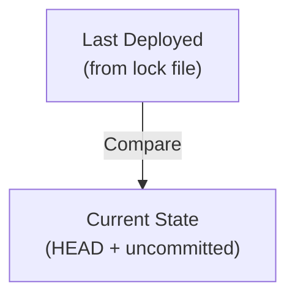
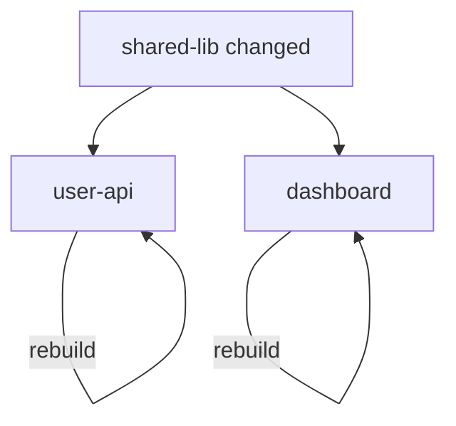

# Change Detection

Bear uses Git to detect changes in your monorepo. Unlike traditional CI systems that compare against a base branch, Bear tracks state per artifact.

## How It Works

For each artifact, Bear compares against its **last deployed commit** (stored in `bear.lock.toml`):



## What Triggers a Rebuild

### 1. Uncommitted Changes

Any changes in the artifact's directory:

- Staged files (`git add`)
- Unstaged modifications
- Untracked files

```bash
# These trigger a rebuild for services/api:
echo "change" >> services/api/main.go    # Unstaged
git add services/api/new-file.go          # Staged
touch services/api/temp.txt               # Untracked
```

### 2. New Commits

Commits affecting the artifact's directory since last deploy:

```bash
# If api was last deployed at commit abc1234
# and there are new commits touching services/api:
git log abc1234..HEAD -- services/api
```

### 3. New Artifacts

Artifacts that have never been deployed (no entry in lock file).

### 4. Dependency Changes

If a library changes, all artifacts that depend on it are marked for rebuild:



## Per-Artifact State

Each artifact is tracked independently:

```toml title="bear.lock.toml"
[artifacts.user-api]
commit = "abc1234567890"
timestamp = "2026-01-04T10:00:00Z"

[artifacts.order-api]
commit = "def4567890123"
timestamp = "2026-01-03T15:30:00Z"
```

This means:

- `user-api` was last deployed from commit `abc1234`
- `order-api` was last deployed from commit `def4567`

They can be at different versions!

## Benefits

1. **No base branch needed** — Works with any Git workflow
2. **Independent tracking** — Deploy one service without affecting others
3. **Accurate detection** — Only rebuild what actually changed
4. **Rollback support** — Deploy any previous version

## See Also

- [Lock File](lock-file.md)
- [Dependencies](dependencies.md)
- [bear plan](../commands/plan.md)
