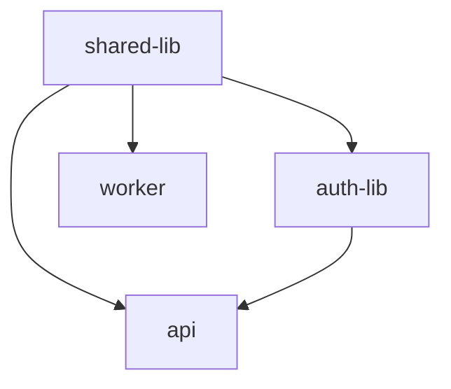

# Dependencies

Bear tracks dependencies between artifacts and automatically rebuilds dependents when a dependency changes.

## Defining Dependencies

In your artifact config, list dependencies by name:

```yaml title="services/api/bear.artifact.yml"
name: api
target: cloudrun
depends:
  - shared-lib
  - auth-lib
```

## Transitive Resolution

Dependencies are resolved transitively. If A depends on B, and B depends on C:

```
C (library)
  ↑
B (library) depends on C
  ↑
A (service) depends on B
```

When C changes:

1. B is marked for revalidation (dependency changed)
2. A is marked for revalidation (transitive dependency changed)
3. A is marked for redeployment (it's a service)

## Libraries vs Services

| Type | Validated | Deployed |
|------|-----------|----------|
| Library (`bear.lib.yml`) | ✓ | ✗ |
| Service (`bear.artifact.yml`) | ✓ | ✓ |

Libraries are validate-only. They exist to:

- Share code between services
- Trigger rebuilds of dependent services

## Example

```
my-monorepo/
├── libs/
│   ├── shared/           # bear.lib.yml: shared-lib
│   └── auth/             # bear.lib.yml: auth-lib (depends: shared-lib)
└── services/
    ├── api/              # bear.artifact.yml: api (depends: shared-lib, auth-lib)
    └── worker/           # bear.artifact.yml: worker (depends: shared-lib)
```

Dependency graph:



If `shared-lib` changes:

- ✓ Revalidate: `auth-lib`, `api`, `worker`
- ✓ Redeploy: `api`, `worker`

## Circular Dependencies

Bear detects and rejects circular dependencies:

```bash
bear check

  Errors:
    Circular dependency: api → lib → api
```

## Viewing Dependencies

Use `bear list --tree` to visualize:

```bash
bear list --tree
```

```
api
├── shared-lib
└── auth-lib
    └── shared-lib

worker
└── shared-lib
```

## Build Order

Bear builds in dependency order:

1. Libraries with no dependencies
2. Libraries that depend on (1)
3. Services that depend on (1) and (2)

This ensures dependencies are validated before dependents.

## See Also

- [Artifacts](../configuration/artifacts.md)
- [bear list](../commands/list.md)
- [Change Detection](change-detection.md)
