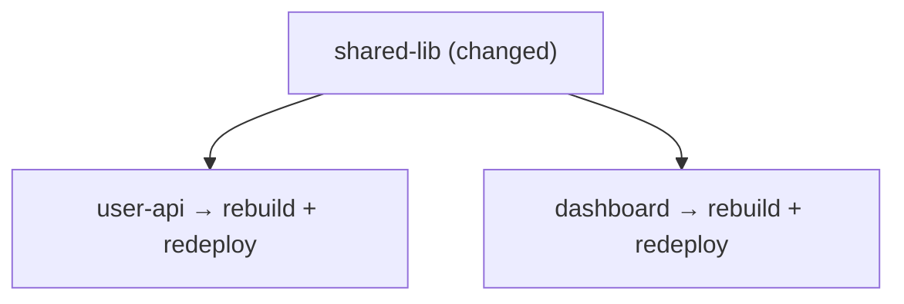

# Configuration

## bear.config.yml

The main project config in your repo root.

### Minimal (with presets)

```yaml
name: my-platform

use:
  languages: [go, node]
  targets: [docker, cloudrun]
```

### Full (custom everything)

```yaml
name: my-platform

# Use presets for common setups
use:
  languages: [go, node, python]
  targets: [docker, cloudrun]

# Override or add custom languages
languages:
  go:
    detection:
      files: [go.mod]
    vars:
      COVERAGE: "80"
    steps:
      - name: Test
        run: go test -race -cover ./...
      - name: Build
        run: go build -o dist/app .

# Override or add custom targets
targets:
  staging:
    vars:
      REGION: europe-west1
    steps:
      - name: Build
        run: docker build -t gcr.io/$PROJECT/$NAME:$VERSION .
      - name: Push
        run: docker push gcr.io/$PROJECT/$NAME:$VERSION
      - name: Deploy
        run: gcloud run deploy $NAME --image gcr.io/$PROJECT/$NAME:$VERSION --region $REGION
```

Custom configs override presets with the same name.

---

## bear.artifact.yml

Place in each deployable service directory.

```yaml
name: user-api             # Unique name
target: cloudrun            # Target from config
depends: [shared-lib]       # Dependencies (optional)

vars:                       # Override variables (optional)
  PROJECT: my-gcp-project
  MEMORY: 1Gi
```

| Field | Required | Description |
|-------|----------|-------------|
| `name` | ✓ | Unique artifact name |
| `target` | ✓ | Deployment target (from config or presets) |
| `depends` | | Dependencies (artifact/library names) |
| `vars` | | Variables passed to all steps |

---

## bear.lib.yml

Place in shared library directories. Libraries are validated but never deployed. When a library changes, all dependents are rebuilt.

```yaml
name: shared-lib
```

| Field | Required | Description |
|-------|----------|-------------|
| `name` | ✓ | Unique library name |
| `depends` | | Dependencies on other libraries |

---

## Languages

Languages define **validation steps** — what runs before deployment (tests, linting, builds).

Bear detects the language automatically by looking for specific files in the artifact directory.

```yaml
languages:
  go:
    detection:
      files: [go.mod]             # Any of these files → this language
    vars:                          # Default variables (optional)
      KEY: value
    steps:
      - name: Test
        run: go test ./...
      - name: Build
        run: go build -o app .
```

### Preset Languages

| Language | Detection | Steps |
|----------|-----------|-------|
| `go` | `go.mod` | download, vet, test, build |
| `node` | `package.json` | install, lint, test, build |
| `typescript` | `tsconfig.json` | install, typecheck, lint, test, build |
| `python` | `requirements.txt` | venv, install, lint, test |
| `rust` | `Cargo.toml` | check, clippy, test, build |
| `java` | `pom.xml` | compile, test, package |

---

## Targets

Targets define **deployment steps** — what runs to deploy an artifact.

```yaml
targets:
  cloudrun:
    vars:
      REGION: europe-west1
      MEMORY: 512Mi
    steps:
      - name: Build
        run: docker build -t gcr.io/$PROJECT/$NAME:$VERSION .
      - name: Push
        run: docker push gcr.io/$PROJECT/$NAME:$VERSION
      - name: Deploy
        run: gcloud run deploy $NAME --image gcr.io/$PROJECT/$NAME:$VERSION --region $REGION
```

### Preset Targets

| Target | Description | Required Vars |
|--------|-------------|---------------|
| `docker` | Build and push Docker images | `REGISTRY` |
| `cloudrun` | Deploy to Google Cloud Run | `PROJECT`, `REGION` |
| `cloudrun-job` | Deploy Cloud Run jobs | `PROJECT`, `REGION` |
| `kubernetes` | Deploy to Kubernetes | `NAMESPACE`, `REGISTRY` |
| `helm` | Deploy with Helm charts | `NAMESPACE`, `REGISTRY` |
| `lambda` | Deploy AWS Lambda functions | `REGION` |
| `s3-static` | Deploy static sites to S3 | `BUCKET`, `CF_DIST` |

---

## Variables

Available in all steps (validation + deployment):

| Variable | Source |
|----------|--------|
| `$NAME` | Artifact name (auto) |
| `$VERSION` | Short commit hash, 7 chars (auto) |
| Custom | From `vars` in language, target, or artifact |

**Precedence** (highest wins):

1. Artifact `vars`
2. Target `vars`
3. Language `vars`
4. `$NAME`, `$VERSION`

OS environment variables are available via the shell.

---

## Presets

Presets are community configs from [bear-presets](https://github.com/irevolve/bear-presets). Cached locally for 24h.

```bash
bear preset list              # Show all presets
bear preset show language go  # Show language details
bear preset show target docker # Show target details
bear preset update            # Refresh cache
```

Override any preset by defining it in your config:

```yaml
use:
  languages: [go]      # Use go preset

languages:
  go:                   # Override with custom steps
    detection:
      files: [go.mod]
    steps:
      - name: Test
        run: go test -cover ./...
```

---

## Dependencies

Dependencies are resolved **transitively**. If shared-lib changes, everything that depends on it rebuilds:



Bear detects and rejects circular dependencies. Run `bear check` to validate.

```bash
bear list --tree    # Visualize dependency tree
```

---

## Lock File

`bear.lock.yml` tracks deployed versions. Auto-managed by Bear.

```yaml title="bear.lock.yml"
artifacts:
  user-api:
    commit: abc1234567890
    timestamp: "2026-01-04T10:00:00Z"
    version: abc1234
    target: cloudrun
  order-api:
    commit: def4567890123
    timestamp: "2026-01-03T15:30:00Z"
    version: def4567
    target: cloudrun
    pinned: true
```

After `bear apply`, the lock file is updated and auto-committed with `[skip ci]`.
Use `--no-commit` to skip auto-commit.

---

## Pinning

Pin an artifact to a specific commit to prevent redeployment or to rollback:

```bash
# Rollback to a known-good version
bear plan user-api --pin abc1234
bear apply

# Future plans skip pinned artifacts
bear plan          # Shows: user-api  pinned

# Unpin and deploy latest
bear plan user-api --force
bear apply
```
