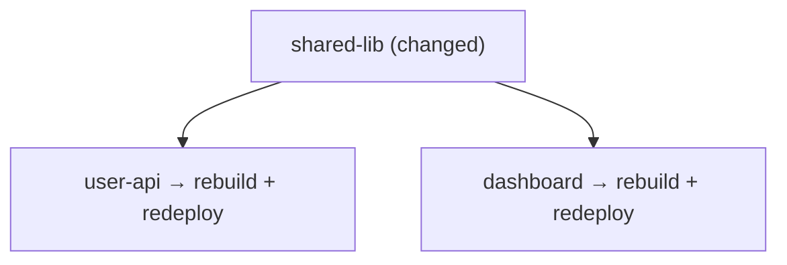

# Configuration

## bear.config.yml

The main config in your Bear project root, which may be a subdirectory of the Git
repository. Select another project root with `-d`.

### Minimal (with presets)

```yaml
name: my-platform
environments: [dev, int, prd]

use:
  revision: dd1dc2dc7854e95be9cb8bbbfbf888225ac2088a
  languages: [go, node]
  targets: [docker, cloudrun]
```

### Presets With Local Overrides

```yaml
name: my-platform
environments: [dev, preprd, prd]

ignore_dirs: [coverage, fixtures/generated-services]

# Use presets for common setups
use:
  revision: dd1dc2dc7854e95be9cb8bbbfbf888225ac2088a
  languages: [go, node, python]
  targets: [docker, cloudrun]

# Override or add custom languages
languages:
  go:
    detection:
      files: [go.mod]
    vars:
      COVERAGE: "80"
    steps:
      - name: Test
        run: go test -race -cover ./...
      - name: Build
        run: go build -o dist/app .

# Override or add custom targets
targets:
  staging:
    vars:
      REGION: europe-west1
    steps:
      - name: Build
        run: docker build -t gcr.io/$PROJECT/$NAME:$VERSION .
      - name: Push
        run: docker push gcr.io/$PROJECT/$NAME:$VERSION
      - name: Deploy
        run: gcloud run deploy $NAME --image gcr.io/$PROJECT/$NAME:$VERSION --region $REGION
```

Local definitions replace the **entire** preset with the same name; fields and
step lists are not merged. A locally defined language/target bypasses that preset's
download. Include every detection rule, variable, and step you need in the override.

### Fields And Validation

| Field | Required | Description |
|-------|----------|-------------|
| `name` | ✓ | Project name; must not be blank |
| `environments` | ✓ | Every deployment environment this project has, in your own order |
| `ignore_dirs` | | Extra artifact-discovery exclusions |
| `use` | | Preset imports: `revision`, `languages`, `targets` |
| `languages` | | Local language definitions: `detection`, `vars`, `steps` |
| `targets` | | Local target definitions: `vars`, `steps` |

Those are the only top-level fields. `use` accepts only `revision`, `languages`, and
`targets`. Local languages accept `detection`, `vars`, and `steps`; targets accept
`vars` and `steps`. Their names come from map keys, not nested `name` fields. Each
step has `name` and `run`.

Project, artifact, and library configs accept exactly one YAML document and reject
unknown fields, including misspellings and obsolete keys. Project names, local
language/target names, artifact/library names, dependency names, and each step's
`name`/`run` must not be blank. Artifacts require a nonblank target. Run `bear doctor`
to catch unknown target references, duplicate artifact/library names, missing
dependencies, and cycles; artifact and library names share one namespace.

Imported preset names must start with a letter or digit, followed by letters,
digits, hyphens, or underscores. These preset-name restrictions are not a general
restriction on all local artifact/project names. `use.revision`, when provided,
must be an immutable 40-character lowercase hexadecimal commit SHA, not a tag,
branch, or abbreviated SHA.

Local language definitions require `steps`; use `steps: []` explicitly for no
validation. Targets must resolve to nonempty deployment steps. Upstream phased
`validation` and `defaults`/`deploy` schemas are normalized by the preset importer,
not accepted as local language/target fields.

### Deployment Environments

`environments` is **required**. It declares every deployment environment the project
has, and every other environment rule is checked against it:

```yaml
name: my-platform
environments: [dev, preprd, prd]
```

Bear has no built-in environments. `dev`, `int`, `prd` is only what
[`bear init`](commands/init.md) writes by default; `[preprd, prd]`, `[prd]` and
`[dev, int, uat, prd]` are equally valid. Omitting the field, or writing
`environments: []`, fails to load every command that reads the config. Each message
below is prefixed with the resolved config path:

```text
bear.config.yml: environments must list at least one deployment environment, for example [dev, int, prd]
```

**Naming.** A name must match `[a-z][a-z0-9-]*` and be 1 to 32 characters:
lowercase, starting with a letter, then letters, digits, or hyphens. Duplicates are
rejected. The constraint exists because the name becomes a `bear.lock.yml` key, the
injected `ENVIRONMENT` value, and a positional CLI argument, so it stays free of
anything that would need quoting in a shell or in YAML:

```text
bear.config.yml: environments: invalid environment name "Prd": use 1 to 32 characters matching [a-z][a-z0-9-]*
bear.config.yml: environments: duplicate environment "dev"
```

**Order is preserved, and means nothing.** Declaration order is what you see in
error messages, in `bear doctor`, and in the per-environment status
`bear list` and `bear list --tree` print. It carries **no promotion semantics**:
declaring `[dev, int, prd]` does not make Bear require a successful `int` deployment
before `prd`, and does not stop `bear plan prd` on source that never reached `int`.
Bear has no notion of a pipeline order. Enforce promotion in CI if you want it.

**The plan argument must be declared.** [`bear plan <environment>`](commands/plan.md)
and [`bear validate --environment`](commands/validate.md) accept only a declared
name:

```text
unknown environment "production": bear.config.yml declares dev, int, prd
```

**Artifact allowlists must be a subset.** Every entry of an artifact's
`environments` allowlist must be declared by the project. An entry that is not is an
error from `bear plan`, `bear validate`, and `bear doctor`, before any step runs:

```text
artifact "api" allows undeclared environment "preprd"; bear.config.yml declares dev, int, prd
```

`bear doctor` applies this per artifact, so one run lists every offender rather than
stopping at the first, and it prints the declared list for reference:

```text
  Environments: dev, int, prd
```

**Retiring an environment is safe.** Removing a name from `environments` does not
touch `bear.lock.yml`: its history under that key is kept, and is neither an error
nor a warning. `bear list` and `bear list --tree` simply stop showing it, because
they report the declared set. [`bear apply`](commands/apply.md) never reads this
file, so no change here can make it reject an approved plan on policy grounds —
though this file is tracked source, so editing it does invalidate an in-flight plan
through the ordinary [source fingerprint](concepts/plan-apply.md#source-safety).
Fix each artifact's allowlist when you retire a name; that is the one thing that
does fail.

Libraries have no environments at all. `bear.lib.yml` has no `environments` field,
and strict decoding rejects one.

### Discovery Exclusions

Bear scans recursively for `bear.artifact.yml` and `bear.lib.yml`. It skips
`.git`, `.bear`, `node_modules`, `vendor`, `generated`, `dist`, and `build`
directories by default. `ignore_dirs` adds exclusions; it does not replace defaults.
A bare name such as `coverage` excludes that directory name at any depth; a path
such as `fixtures/generated-services` matches relative to the project root.
Entries are literal directory names/paths, not glob patterns, and must be relative
without `..` components or backslashes. The project root itself is not skipped.

These are artifact-discovery rules, not source-fingerprint exclusions or Git ignore
rules. Nonignored source in these directories can still affect clean-source checks
and fingerprints. See [Source Safety](concepts/plan-apply.md#source-safety).

---

## bear.artifact.yml

Place in each deployable service directory.

```yaml
name: user-api             # Unique name
target: cloudrun            # Target from config
language: go                # Explicit configured language (optional)
depends: [shared-lib]       # Dependencies (optional)
environments: [dev, int]    # Allow deployment only in these environments

vars:                       # Override variables (optional)
  PROJECT: my-gcp-project
  MEMORY: 1Gi
```

| Field | Required | Description |
|-------|----------|-------------|
| `name` | ✓ | Unique artifact name |
| `target` | ✓ | Deployment target (from config or presets) |
| `language` | | Explicit configured language; bypass automatic detection |
| `depends` | | Dependencies (artifact/library names) |
| `environments` | | Deployment allowlist; must be a subset of the project's declared environments. Absent or `[]` disables all deployment |
| `vars` | | Variables passed to all steps |

### Environment Deployment Policy

`environments` is a deployment allowlist, narrowing the project's declared
environments for this one artifact. Omitting it or using `[]` disables deployment
everywhere; change detection and dependency propagation for this artifact still
run. Repeat the project's whole list to allow all of
them. Every entry must be
[declared in `bear.config.yml`](#deployment-environments); one that is not is an
error from `bear plan`, `bear validate`, and `bear doctor`:

```text
artifact "api" allows undeclared environment "preprd"; bear.config.yml declares dev, int, prd
```

Names are case-sensitive and follow the same `[a-z][a-z0-9-]*` rule as the
declaration; duplicates within one allowlist are rejected too. Every plan requires an
explicit environment as the first positional argument, including a plan that ends
up with nothing to deploy and one selecting unchanged or pinned artifacts:

```bash
bear plan dev user-api # user-api can deploy
bear plan prd user-api # user-api's source is checked, but deployment is skipped
bear apply            # Executes the saved plan, including its environment decision
```

Only the positional environment argument selects deployment policy. Inherited or configured `ENVIRONMENT`
variables cannot satisfy this requirement. Bear does not infer the environment from
job/process variables, branch names, or CI metadata. Selecting an environment does
not enable deployment for artifacts with absent or empty allowlists. The environment
controls deployment eligibility and is injected as `ENVIRONMENT` into every step
`bear apply` later runs for a deploying artifact — plan itself runs no steps, so
nothing consumes the variable at plan time. It does not automatically
select targets or credentials; steps can use the variable for that purpose.

Disabled artifacts still have their source compared against history and propagate
changes to dependents, including transitive dependents; they only skip the deploy
step of that comparison. Each dependent's own
deployment policy is evaluated independently. Deployment skips include an explicit
reason. Neither `--pin` nor `--force` overrides this policy. Skipped deployments do
not create or update lock entries.

The environment, allowlists, and resulting deploy/skip decisions are snapshotted in `.bear/plan.yml`.
`bear apply` does not re-evaluate policy. Re-run `bear plan <environment> [artifacts...]` after
changing policy or the intended environment, including changes made after approval.
Old saved plans lacking the allowlist snapshot must be regenerated before apply.

v5.0.0 made the project's `environments` declaration required, and an allowlist a
subset of it; see the [v5 upgrade guide](migration-v5.md). v4.0.0 introduced the
allowlist itself: `disabled_environments` was replaced by `environments` listing the
environments that are **allowed**, not the ones previously denied. The old denylist
is not supported, and an artifact without an allowlist does not deploy.

---

## bear.lib.yml

Place in shared library directories. Libraries are never deployed, but `bear
validate` runs their language's steps like any other artifact.
Their changes can trigger dependent validation/deployment, subject to artifact
selection, pins, and each dependent's environment policy.

```yaml
name: shared-lib
```

| Field | Required | Description |
|-------|----------|-------------|
| `name` | ✓ | Unique library name |
| `language` | | Explicit configured language; bypass automatic detection |
| `depends` | | Dependencies on other libraries |

Library config accepts only `name`, `language`, and `depends`; deployment targets,
allowlists, and `vars` belong to artifact definitions, not libraries. There is no
`environments` field here and strict decoding rejects one, because a library is
never deployed to an environment.

---

## Languages

Languages define **build steps** — what `bear apply` runs first for a deploying
artifact (tests, linting, builds), and what `bear validate` runs on demand
against the working tree with no deployment involved. `bear plan` never runs
these steps; it only decides which artifacts would deploy.

Bear detects languages from configured `detection.files` (any listed file) or
`detection.pattern` (a valid glob), relative to the artifact/library directory.
Rules must be relative, without `..` components or backslashes. Detection only
uses configured/imported languages; it does not fetch additional presets.

If multiple languages match, scanning fails with an ambiguity error rather than
choosing one. Set `language: <configured-name>` in `bear.artifact.yml` or
`bear.lib.yml` to resolve it, for example when Node and TypeScript rules overlap.
An explicit language must be configured, but need not match its detection rules.
No match yields `unknown`; `bear doctor` warns, and no language build steps run.

```yaml
languages:
  go:
    detection:
      files: [go.mod]             # Any of these files → this language
    vars:                          # Default variables (optional)
      KEY: value
    steps:
      - name: Test
        run: go test ./...
      - name: Build
        run: go build -o app .
```

### Preset Languages

Available names include `go`, `node`, `typescript`, `python`, `rust`, and `java`.
Exact detection rules and commands depend on the selected revision. Inspect them
with `bear preset show language <name> --revision <sha>` before use. At the default
SHA, Python and Java use Bear's maintained corrections rather than the upstream
failure-masking commands; see [Maintained Corrections](commands/preset.md#maintained-corrections).

---

## Targets

Targets define **deployment steps** — what `bear apply` runs second for a
deploying artifact, right after that artifact's language build steps complete.
`bear plan` never runs these steps either.

```yaml
targets:
  cloudrun:
    vars:
      REGION: europe-west1
      MEMORY: 512Mi
    steps:
      - name: Build
        run: docker build -t gcr.io/$PROJECT/$NAME:$VERSION .
      - name: Push
        run: docker push gcr.io/$PROJECT/$NAME:$VERSION
      - name: Deploy
        run: gcloud run deploy $NAME --image gcr.io/$PROJECT/$NAME:$VERSION --region $REGION
```

### Preset Targets

Available targets include `docker`, `cloudrun`, `cloudrun-job`, `kubernetes`,
`helm`, `lambda`, and `s3-static`. Inspect the effective defaults and commands with
`bear preset show target <name> --revision <sha>`; required variables, files,
toolchains, credentials, and runtime packaging depend on those commands. A target
name alone does not make an arbitrary application compatible with that platform.

---

## Variables

Variables are passed to steps as shell environment variables:

| Variable | Source |
|----------|--------|
| `$ENVIRONMENT` | Injected into every step `bear apply` runs for a deploying artifact, and into `bear validate`'s steps when `--environment` is given; not an input for policy selection |
| `$NAME` | Artifact name (auto, deployment only) |
| `$VERSION` | Short commit hash, 7 chars (auto, deployment only) |
| Custom | From `vars` in language, target, or artifact |

**Precedence** (highest wins):

1. `$ENVIRONMENT` from the plan's selected environment; automatic `$NAME` and `$VERSION` for deployment
2. Artifact `vars`
3. Target `vars`
4. Language `vars`
5. Inherited OS environment

Inherited job/process `ENVIRONMENT` variables and artifact, target, or language `vars`
do not select deployment policy or satisfy the required positional argument.
`bear plan` saves the selected environment with each deploying artifact's
variables; it does not run any step itself, so nothing is injected until `bear
apply` runs that artifact's build and deploy steps, at which point the saved
value overrides configured or inherited values — a different process environment
during `bear apply` cannot override it.

Use it directly in steps or reference it from other variables:

```yaml
targets:
  kubernetes:
    vars:
      NAMESPACE: "myapp-${ENVIRONMENT}"
    steps:
      - name: Deploy
        run: kubectl apply -n "$NAMESPACE" -f "deploy/$ENVIRONMENT.yml"
```

---

## Presets

Presets come from [bear-presets](https://github.com/irevolve/bear-presets) at an
immutable revision. Pin it explicitly in project config:

```yaml
use:
  revision: dd1dc2dc7854e95be9cb8bbbfbf888225ac2088a
  languages: [go, python]
  targets: [cloudrun]
```

Omitting `use.revision` selects Bear's compiled default, currently the SHA above.
An explicit SHA keeps the project selection stable across Bear upgrades. Cache
files live in `~/.bear/presets/<revision>/`, do not expire, and can be reused offline
when present and valid. Missing/invalid files require fetching and validation.

```bash
bear preset list              # Show all presets
bear preset show language go  # Show language details
bear preset show target docker # Show target details
bear preset update            # Populate/repair the default revision's cache
bear preset update --revision dd1dc2dc7854e95be9cb8bbbfbf888225ac2088a
```

Preset CLI commands use their own `--revision`, not project `use.revision`, and do
not modify the project selection. Update downloads and validates the complete
revision before publishing files atomically, preserving already-valid cached files.
It does not advance to latest upstream or replace the entire cache transactionally.
See [Preset Commands](commands/preset.md) for offline behavior and the exact-SHA
Python/Java corrections. Other custom revisions and local commands are not rewritten.

Replace any preset with a complete local definition:

```yaml
use:
  languages: [go]      # Use go preset

languages:
  go:                   # Override with custom steps
    detection:
      files: [go.mod]
    steps:
      - name: Test
        run: go test -cover ./...
```

---

## Dependencies

Dependencies are resolved **transitively**. If shared-lib changes, everything that depends on it rebuilds:


```mermaid
flowchart TB
    A["shared-lib (changed)"] --> B["user-api → rebuild + redeploy"]
    A --> C["dashboard → rebuild + redeploy"]
```

Bear detects and rejects circular dependencies. Run `bear doctor` to validate.
Dependency-triggered redeployment still requires each dependent's own allowlist to
include the selected environment.

```bash
bear list --tree    # Visualize dependency tree
```

---

## Lock File

`bear.lock.yml` tracks deployed versions and pins per environment and artifact.
It is auto-managed by Bear.

```yaml title="bear.lock.yml"
environments:
  dev:
    user-api:
      commit: abc1234567890
      timestamp: "2026-01-04T10:00:00Z"
      version: abc1234
      target: cloudrun
    order-api:
      commit: def4567890123
      timestamp: "2026-01-03T15:30:00Z"
      version: def4567
      target: cloudrun
      pinned: true
```

During `bear apply`, each successful deployment atomically saves lock history and
then checkpoints completion in the plan. After all deployments succeed, Bear
commits the lock with `[skip ci]` and pushes it. Use `--no-commit` to skip commit
and push, retaining local history for your own publication process.

Legacy top-level `artifacts` entries have no environment provenance. They are
retained but ignored, not automatically mapped; replan and review each environment.
Regenerate old plans missing source or policy snapshots. History under a key the
project no longer declares is kept as well, and is neither an error nor a warning;
`bear list` and `bear list --tree` just stop showing it. See
[Lock File](concepts/lock-file.md) and [Retries](concepts/plan-apply.md#retries).

---

## Pinning

Pin an artifact to a specific commit to prevent redeployment or to rollback:

```bash
# Rollback to a known-good version
bear plan dev user-api --pin abc1234
bear apply

# Future plans skip pinned artifacts
bear plan dev # Shows: user-api  pinned

# Unpin and deploy latest
bear plan dev user-api --force
bear apply
```

These examples assume the project declares `dev` and `user-api`'s `environments`
allowlist includes it. Neither pinning nor forcing enables deployment when the
allowlist is absent, empty, or excludes the selected environment.

Pins use private worktrees at the selected commit; plan only resolves the commit
and takes its fingerprint there — it does not build or test it. Apply recreates
the worktree, then runs the language's build steps and the target's deploy steps
fresh, exactly as it would for a normal deployment, after verifying the
fingerprint. Current configuration supplies the snapshotted policy
and steps. See [Pinning](concepts/pinning.md) for source and rollback limits.
