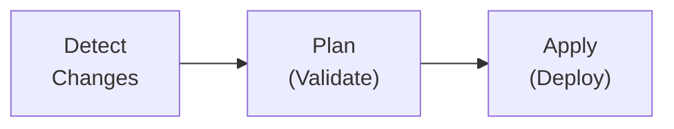

# 🐻 Bear

> **B**uild, **E**valuate, **A**pply, **R**epeat

A Terraform-inspired CI/CD tool for monorepos. Bear detects changes, resolves dependencies, and orchestrates builds and deployments with a simple plan/apply workflow.

## Features

- 🔍 **Git-based change detection** — Only build what changed
- 🔗 **Dependency tracking** — Automatically rebuild dependents
- 📋 **Plan/Apply workflow** — Review changes before deploying
- 🔒 **Lock file** — Track deployed versions per artifact
- 📚 **Library support** — Validate-only artifacts
- 🔄 **Pinning** — Pin artifacts to specific versions, rollback by pinning to older commits
- 🌍 **Multi-language** — Go, Node, Python, Rust, Java, TypeScript
- 🎯 **Many targets** — Docker, CloudRun, Kubernetes, Lambda, S3, Helm

## Quick Example

```toml title="bear.config.toml"
name = "my-platform"

[use]
languages = ["go", "node"]
targets = ["docker", "cloudrun"]
```

```toml title="services/api/bear.artifact.toml"
name = "api"
target = "cloudrun"
depends = ["shared-lib"]

[vars]
PROJECT = "my-gcp-project"
```

```bash
# See what would happen
bear plan

# Execute the plan
bear apply
```

## How It Works



1. **Detect** — Compare each artifact against its last deployed commit
2. **Plan** — Validate changed artifacts in parallel, write deployment plan
3. **Apply** — Deploy from the plan, update lock file

## Getting Started

- 📥 [**Installation**](getting-started/installation.md) — Install Bear via `go install` or build from source
- 🚀 [**Quick Start**](getting-started/quickstart.md) — Get up and running in 5 minutes
- ⚙️ [**Configuration**](configuration/project.md) — Learn about `bear.config.toml` and artifacts
- 📦 [**Presets**](configuration/presets.md) — Use community presets for languages and targets
