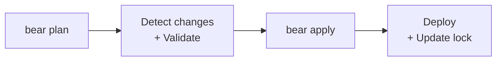

# Bear

> **B**uild, **E**valuate, **A**pply, **R**epeat

A Terraform-inspired CI/CD tool for monorepos. Detect changes, validate, deploy — only what changed.



## 30-Second Example

```yaml title="bear.config.yml"
name: my-platform

use:
  languages: [go, node]
  targets: [docker, cloudrun]
```

```yaml title="services/api/bear.artifact.yml"
name: api
target: cloudrun
depends: [shared-lib]
```

```bash
bear plan    # detect changes, validate
bear apply   # deploy
```

That's it. Bear detects which services changed, runs validation (tests, linting, builds), and deploys only what's needed.

## Key Features

| Feature | Description |
|---------|-------------|
| **Change detection** | Git-based, per-artifact tracking — no base branch needed |
| **Dependencies** | Libraries trigger rebuilds of dependent services |
| **Plan/Apply** | Review what will happen before deploying |
| **Lock file** | Tracks deployed versions per artifact |
| **Pinning** | Pin artifacts to specific commits, rollback instantly |
| **Presets** | Pre-built configs for Go, Node, Python, Rust, Java |

## Project Structure

```
my-monorepo/
├── bear.config.yml              # Project config
├── bear.lock.yml                # Deployed versions (auto-managed)
├── services/
│   ├── user-api/
│   │   ├── bear.artifact.yml    # Deployable service
│   │   └── ...
│   └── order-api/
│       └── bear.artifact.yml
└── libs/
    └── shared/
        └── bear.lib.yml         # Library (validate-only)
```

## Next

- [Getting Started](getting-started.md) — Install and first deploy in 5 minutes
- [Configuration](configuration.md) — All config options
- [CI/CD](ci-cd.md) — GitHub Actions, GitLab CI, Jenkins
