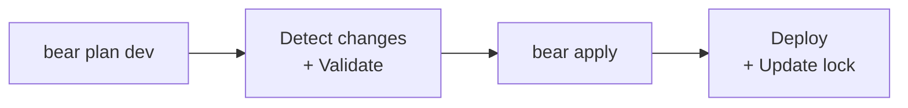

# Bear

> **B**uild, **E**valuate, **A**pply, **R**epeat

A Terraform-inspired CI/CD tool for monorepos. Detect changes, validate, deploy — only what changed.

!!! warning "Upgrading to v4.0.0"
    Read the [monorepo migration guide](migration-v4.md) before running CI.
    Deployment now requires per-artifact environment allowlists. Legacy lock history
    is not automatically migrated, so the first environment plan can redeploy artifacts.
    Recreate old plans. See the [v4.0.0 release notes](releases/v4.0.0.md).


```mermaid
flowchart LR
    A["bear plan dev"] --> B["Detect changes\n+ Validate"]
    B --> C["bear apply"]
    C --> D["Deploy\n+ Update lock"]
```

## 30-Second Example

```yaml title="bear.config.yml"
name: my-platform

use:
  languages: [go, node]
  targets: [docker, cloudrun]
```

```yaml title="services/api/bear.artifact.yml"
name: api
target: cloudrun
environments: [dev, int, prd]
depends: [shared-lib]
```

```bash
bear plan dev # detect changes, validate, plan for dev
bear apply    # deploy the saved plan
```

That's it. Bear detects which services changed, runs validation (tests, linting, builds), and deploys only what's needed.

Deployment requires the selected environment to be in the artifact's `environments`
allowlist. Absent or `[]` means validation only, with no deployment. Every plan requires
`dev`, `int`, or `prd` as its first positional argument, including validation-only plans. Inherited or configured
`ENVIRONMENT` variables cannot select policy or satisfy this requirement.

Normal plans with deployments require clean Git source before validation. Apply
checks the saved commit and post-validation source fingerprint. Ignored build
dependencies are outside this guarantee; see [Source Safety](concepts/plan-apply.md#source-safety).

## Key Features

| Feature | Description |
|---------|-------------|
| **Change detection** | Git-based, per-artifact tracking — no base branch needed |
| **Dependencies** | Libraries trigger rebuilds of dependent services |
| **Plan/Apply** | Review what will happen before deploying |
| **Lock file** | Tracks deployed versions and pins per environment and artifact |
| **Pinning** | Validate and deploy selected revisions in private worktrees |
| **Presets** | Pre-built configs for Go, Node, Python, Rust, Java |

## Project Structure

```
my-monorepo/
├── bear.config.yml              # Project config
├── bear.lock.yml                # Deployed versions (auto-managed)
├── services/
│   ├── user-api/
│   │   ├── bear.artifact.yml    # Deployable service
│   │   └── ...
│   └── order-api/
│       └── bear.artifact.yml
└── libs/
    └── shared/
        └── bear.lib.yml         # Library (validate-only)
```

## Next

- [Getting Started](getting-started.md) — Install and first deploy in 5 minutes
- [Configuration](configuration.md) — All config options
- [CI/CD](ci-cd.md) — GitHub Actions, GitLab CI, Jenkins
