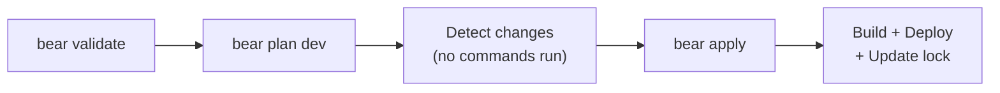

# Bear

> **B**uild, **E**valuate, **A**pply, **R**epeat

A Terraform-inspired CI/CD tool for monorepos. Detect changes, validate, deploy — only what changed.

!!! warning "Upgrading to v5.0.0"
    v5.0.0 has three breaking changes: deployment environments are now declared
    per project (add a required `environments:` list to `bear.config.yml` and
    make every artifact allowlist a subset of it); `bear plan` no longer runs
    any commands and `bear apply` now always builds immediately before it
    deploys, so a plan file saved before this release is rejected, not
    misapplied; and `bear check` is renamed to `bear doctor`, with no alias.
    `bear.lock.yml` is untouched. Read the
    [v5 upgrade guide](migration-v5.md) and the
    [v5.0.0 release notes](releases/v5.0.0.md).

    Coming from v3 or earlier? Do the [v4 migration](migration-v4.md) first:
    deployment requires per-artifact environment allowlists, legacy lock history is
    not automatically migrated, and old plans must be recreated.


```mermaid
flowchart LR
    V["bear validate"] --> A["bear plan dev"]
    A --> B["Detect changes\n(no commands run)"]
    B --> C["bear apply"]
    C --> D["Build + Deploy\n+ Update lock"]
```

## 30-Second Example

```yaml title="bear.config.yml"
name: my-platform
environments: [dev, int, prd]

use:
  languages: [go, node]
  targets: [docker, cloudrun]
```

```yaml title="services/api/bear.artifact.yml"
name: api
target: cloudrun
environments: [dev, int, prd]
depends: [shared-lib]
```

```bash
bear validate # run every artifact's build steps (merge request)
bear plan dev # decide what would deploy for dev; runs nothing
bear apply    # build and deploy the plan
```

That's it. Bear detects which services changed, and when you apply, builds
(tests, linting) and deploys only what's needed.

`bear.config.yml` declares the project's deployment environments; there is no
built-in set, and `[dev, int, prd]` above is only `bear init`'s default. Deployment
then requires the selected environment to be in the artifact's `environments`
allowlist, which must be a subset of the declared list. Absent or `[]` means the
artifact never deploys, though change detection and dependency propagation still
run. Every plan requires a declared environment as
its first positional argument, even one that ends up with nothing to deploy. Inherited or configured
`ENVIRONMENT` variables cannot select policy or satisfy this requirement.

A normal plan with any deployments requires clean Git source before it runs —
plan itself executes nothing. Apply
checks the saved commit and fingerprint, then builds and deploys fresh for every
artifact it deploys. Ignored build
dependencies are outside the fingerprint guarantee; see [Source Safety](concepts/plan-apply.md#source-safety).

## Commands

| Command | Description |
|---------|-------------|
| [`bear init`](commands/init.md) | Initialize a new project |
| [`bear doctor`](commands/doctor.md) | Validate config and dependencies |
| [`bear validate [artifacts...]`](commands/validate.md) | Run build steps against the working tree; no environment, no plan, no deployment |
| [`bear plan <environment> [artifacts...]`](commands/plan.md) | Decide what would deploy for an environment declared in `bear.config.yml`; runs no commands |
| [`bear apply`](commands/apply.md) | Build and deploy the plan |
| [`bear list [--tree]`](commands/list.md) | List artifacts / dependency tree |
| [`bear preset`](commands/preset.md) | Manage presets |

The chain is `doctor` (configuration) → `validate` (merge request) → `plan`
(deployment review and approval) → `apply` (execution). `bear validate` takes no
environment, writes no plan and runs no Git, so a shallow merge-request checkout
with no deployment credentials is enough. `bear plan` runs no commands at all — it
is a pure decision. `bear apply` is the only command that executes anything: for
every deploying artifact it runs the language's build steps, then the target's
deploy steps.

## Key Features

| Feature | Description |
|---------|-------------|
| **Change detection** | Git-based, per-artifact tracking — no base branch needed |
| **Dependencies** | Libraries trigger rebuilds of dependent services |
| **Plan/Apply** | Review what will happen before deploying |
| **Lock file** | Tracks deployed versions and pins per environment and artifact |
| **Pinning** | Validate and deploy selected revisions in private worktrees |
| **Presets** | Pre-built configs for Go, Node, Python, Rust, Java |

## Project Structure

```
my-monorepo/
├── bear.config.yml              # Project config
├── bear.lock.yml                # Deployed versions (auto-managed)
├── services/
│   ├── user-api/
│   │   ├── bear.artifact.yml    # Deployable service
│   │   └── ...
│   └── order-api/
│       └── bear.artifact.yml
└── libs/
    └── shared/
        └── bear.lib.yml         # Library (validate-only)
```

## Next

- [Getting Started](getting-started.md) — Install and first deploy in 5 minutes
- [Configuration](configuration.md) — All config options
- [CI/CD](ci-cd.md) — GitHub Actions, GitLab CI, Jenkins
- [Upgrade to v5](migration-v5.md) — Declare your deployment environments
